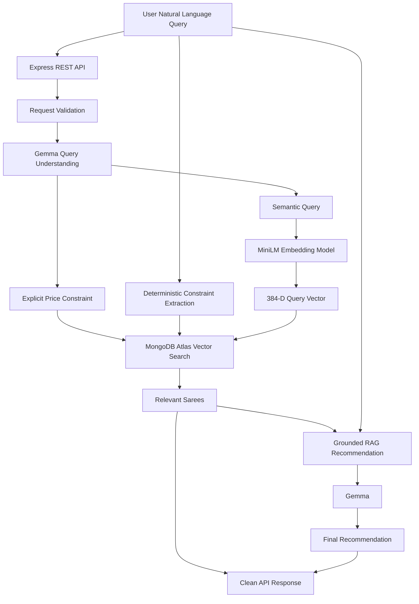

# 🥻 Saree Saathi AI

> **AI-powered semantic saree discovery for a real-world local saree business.**

Saree Saathi AI is an open-source AI search and recommendation backend built to help customers find sarees using **natural language** instead of rigid product filters.

Instead of requiring users to know exact product names, fabrics, or catalog terminology, they can ask things like:

```text
"I need a traditional silk saree for a wedding under ₹7000"

"Show me a lightweight cotton saree for office wear"

"I want something elegant from Andhra Pradesh for a wedding"
```

The system combines **LLM-powered query understanding, deterministic constraints, local embeddings, MongoDB Atlas Vector Search, hybrid filtering, and grounded RAG recommendations**.

---

## ✨ Why Saree Saathi AI?

Traditional product search usually depends on exact filters:

```text
Fabric = Silk
Price < ₹7000
Occasion = Wedding
```

That works when users already know what they want.

Real users often search more naturally:

> "I need something elegant for my sister's wedding, preferably silk and not too expensive."

Saree Saathi AI converts this natural language into a structured + semantic search request while keeping hard constraints deterministic.

### Core idea

```text
Natural Language
       ↓
AI Query Understanding
       ↓
Semantic Meaning + Explicit Constraints
       ↓
Hybrid Search
       ↓
Relevant Sarees
       ↓
Grounded AI Recommendation
```

---

# 🏗️ Architecture



---

# 🧠 AI Pipeline

Saree Saathi AI deliberately separates **semantic understanding** from **hard database constraints**.

## 1. Query Understanding — Gemma

The local Gemma model converts the user's request into a small structured representation.

Example:

```json
{
	"semanticQuery": "traditional silk saree for a wedding",
	"maxPrice": 7000
}
```

The LLM is responsible for understanding language.

It is **not trusted to generate MongoDB operators or arbitrary database filters**.

---

## 2. Deterministic Hard Constraints

Explicit catalog constraints are extracted using application code.

For example:

```text
"I want a silk saree from Andhra Pradesh"
```

becomes:

```json
{
	"fabric": "Silk",
	"state": "Andhra Pradesh"
}
```

This design prevents an LLM from hallucinating structured values.

### Design principle

> **LLM for meaning. Application code for rules.**

---

# 🔎 Semantic Search

Saree Saathi AI uses:

**`Xenova/all-MiniLM-L6-v2`**

as the embedding model.

Each saree is converted into a **384-dimensional vector**.

For example:

```text
"Traditional silk saree suitable for a wedding"
```

and

```text
"Elegant silk saree for a marriage ceremony"
```

produce vectors that are highly similar even though the wording is different.

This enables semantic search instead of simple keyword matching.

### Embedding flow

```text
Saree Description
       ↓
MiniLM
       ↓
384-dimensional vector
       ↓
MongoDB Atlas
```

The same model converts the user's search query into a vector:

```text
User Query
    ↓
MiniLM
    ↓
Query Vector
    ↓
MongoDB Atlas Vector Search
```

---

# 🍃 MongoDB Atlas Vector Search

MongoDB Atlas stores both:

- structured saree information
- vector embeddings

Example document conceptually looks like:

```json
{
	"id": "SAR003",
	"name": "Uppada Jamdani Silk Saree",
	"state": "Andhra Pradesh",
	"fabric": "Silk",
	"price": 6500,
	"available": true,
	"embedding": [0.012, -0.034, 0.087, "..."]
}
```

The vector index uses:

```text
Dimensions: 384
Similarity: cosine
```

The index also supports filters for:

```text
price
available
fabric
state
```

---

# 🔀 Hybrid Search

Pure vector search is excellent for meaning, but it should not be responsible for exact numeric constraints.

For example:

> "Silk saree under ₹7000"

Semantic search understands the meaning of the request, but **₹7000 is an exact business constraint**.

Saree Saathi therefore combines:

```text
Semantic Similarity
        +
Structured Filters
        ↓
Hybrid Search
```

Example:

```text
Query:
"traditional silk saree for a wedding under ₹7000"

Semantic:
"traditional silk saree for a wedding"

Filters:
fabric = Silk
price <= 7000
available = true
```

This produces more reliable results than relying on vector similarity alone.

---

# 📚 Grounded RAG Recommendations

After MongoDB returns the relevant sarees, Gemma generates a recommendation using **only the retrieved catalog data**.

The model is explicitly instructed not to invent:

- prices
- fabrics
- colors
- origins
- availability
- reviews
- product qualities
- unsupported product claims

Example:

```text
User:
"I need a cotton saree for office under ₹3000"

Retrieved:
Mangalagiri Cotton Saree — ₹1800
Mangalagiri Cotton Saree — ₹2200
Pochampally Ikat Cotton Saree — ₹2400

Recommendation:
"I recommend the Mangalagiri Cotton Saree (SAR001).
It's priced at ₹1800 and is suitable for office wear..."
```

This is a **grounded generation** approach:

```text
User Query
    +
Retrieved Catalog Context
    ↓
Gemma
    ↓
Grounded Recommendation
```

---

# 🛡️ Important AI Safety / Design Principle

The application follows:

```text
User
 ↓
LLM
 ↓
Validated structured data
 ↓
Application logic
 ↓
MongoDB
```

and **not**:

```text
User
 ↓
LLM
 ↓
Raw MongoDB query
```

The LLM never gets to generate arbitrary MongoDB operators.

This reduces the risk of:

- hallucinated filters
- malformed queries
- unintended database operations
- coupling business rules to model behavior

---

# 🚀 Current Features

- [x] Natural-language saree search
- [x] Local open-source embedding model
- [x] 384-dimensional semantic embeddings
- [x] MongoDB Atlas Vector Search
- [x] Cosine similarity search
- [x] Hybrid semantic + metadata filtering
- [x] Price filtering
- [x] Availability filtering
- [x] Fabric filtering
- [x] State filtering
- [x] LLM-powered query understanding
- [x] Deterministic hard-constraint extraction
- [x] Grounded RAG recommendations
- [x] Express REST API
- [x] Request validation
- [x] API response formatting
- [x] Centralized error handling
- [x] AI operation timeout protection
- [x] Health endpoint
- [x] Local development with Ollama
- [x] Environment-variable based configuration

---

# 🧰 Tech Stack

| Category        | Technology                  |
| --------------- | --------------------------- |
| Runtime         | Node.js                     |
| Language        | JavaScript / ES Modules     |
| API             | Express.js                  |
| LLM             | Gemma 3 1B via Ollama       |
| Embeddings      | `Xenova/all-MiniLM-L6-v2`   |
| Vector Database | MongoDB Atlas               |
| Vector Search   | MongoDB Atlas Vector Search |
| Database Driver | MongoDB Node.js Driver      |
| AI Runtime      | Ollama                      |
| Environment     | dotenv                      |
| Version Control | Git / GitHub                |

---

# 📁 Project Structure

```text
saree-saathi-ai/
│
├── data/
│   ├── sarees.json
│   └── sarees-with-embeddings.json   # generated, gitignored
│
├── src/
│   │
│   ├── ai-search.js
│   ├── embedding.js
│   ├── query-understanding.js
│   ├── query-constraints.js
│   ├── server.js
│   │
│   ├── controllers/
│   │   └── search-controller.js
│   │
│   ├── errors/
│   │   └── AppError.js
│   │
│   ├── middleware/
│   │   ├── validate-search.js
│   │   └── error-handler.js
│   │
│   ├── routes/
│   │   └── search.js
│   │
│   ├── services/
│   │   ├── saree-search.js
│   │   └── recommendation.js
│   │
│   └── utils/
│       ├── format-search-result.js
│       └── with-timeout.js
│
├── .env.example
├── .gitignore
├── package.json
└── README.md
```

> File names may evolve as the project grows. Generated embedding files and secrets should never be committed.

---

# 🖥️ Run Locally

## Prerequisites

Install:

- Node.js
- npm
- MongoDB Atlas account
- Ollama

Verify Node:

```bash
node --version
npm --version
```

Verify Ollama:

```bash
ollama --version
```

---

## 1. Clone the repository

```bash
git clone <YOUR_GITHUB_REPOSITORY_URL>
cd saree-saathi-ai
```

---

## 2. Install dependencies

```bash
npm install
```

---

## 3. Configure environment variables

Create:

```text
.env
```

Example:

```env
MONGODB_URI=your_mongodb_connection_string
PORT=3000
```

Never commit the real `.env` file.

---

# 🤖 Start Ollama

Start the Ollama server:

```bash
ollama serve
```

In another terminal, pull the model:

```bash
ollama pull gemma3:1b
```

Verify:

```bash
ollama list
```

The project currently uses:

```text
gemma3:1b
```

A larger Gemma model can be experimented with later.

---

# 🧬 Generate Catalog Embeddings

Generate embeddings for the sample catalog:

```bash
npm run catalog:embed
```

This generates:

```text
data/sarees-with-embeddings.json
```

The generated file is intentionally excluded from Git.

---

# 🍃 Import Data into MongoDB Atlas

After configuring `MONGODB_URI`:

```bash
npm run mongo:import
```

The catalog is imported into:

```text
Database: saree_saathi
Collection: sarees
```

---

# 🔎 Configure MongoDB Vector Search

Create an Atlas Vector Search index named:

```text
saree_vector_index
```

The vector field should use:

```json
{
	"fields": [
		{
			"type": "vector",
			"path": "embedding",
			"numDimensions": 384,
			"similarity": "cosine"
		},
		{
			"type": "filter",
			"path": "price"
		},
		{
			"type": "filter",
			"path": "available"
		},
		{
			"type": "filter",
			"path": "fabric"
		},
		{
			"type": "filter",
			"path": "state"
		}
	]
}
```

Wait until the index status becomes **READY**.

---

# 🧪 Test Semantic Search

The project includes a local search test command:

```bash
npm run search:test
```

This can be used to verify vector search independently before testing the complete API.

---

# ▶️ Start the API

```bash
npm run server
```

Expected:

```text
Saree Saathi API running on http://localhost:3000
```

---

# ❤️ Health Check

```bash
curl http://localhost:3000/health
```

Expected:

```json
{
	"status": "ok",
	"service": "saree-saathi-ai"
}
```

---

# 🔍 API Usage

## Search Sarees

### Endpoint

```http
POST /api/search
```

### Request

```json
{
	"query": "Show me a cotton saree for office under ₹3000"
}
```

### cURL

```bash
curl -X POST http://localhost:3000/api/search \
  -H "Content-Type: application/json" \
  -d '{"query":"Show me a cotton saree for office under ₹3000"}'
```

### Example response

```json
{
	"query": {
		"semanticQuery": "cotton saree for office",
		"maxPrice": 3000
	},
	"constraints": {
		"fabric": "Cotton"
	},
	"results": [
		{
			"id": "SAR001",
			"name": "Mangalagiri Cotton Saree",
			"origin": "Mangalagiri",
			"state": "Andhra Pradesh",
			"fabric": "Cotton",
			"color": "Peacock Blue",
			"occasion": ["Daily Wear", "Office", "Festive"],
			"style": "Traditional",
			"price": 1800,
			"description": "Lightweight Mangalagiri cotton saree with a traditional zari Nizam border. Comfortable for everyday wear, office use and simple festive occasions."
		}
	],
	"recommendation": "I recommend the Mangalagiri Cotton Saree (SAR001)..."
}
```

---

# ❌ Request Validation

Invalid requests are rejected before entering the AI pipeline.

### Missing query

```bash
curl -X POST http://localhost:3000/api/search \
  -H "Content-Type: application/json" \
  -d '{}'
```

Expected:

```json
{
	"error": "Missing required field: query"
}
```

### Invalid type

```json
{
	"query": 123
}
```

Expected:

```json
{
	"error": "Field 'query' must be a string"
}
```

### Empty query

```json
{
	"query": "   "
}
```

Expected:

```json
{
	"error": "Query cannot be empty"
}
```

### Query too long

Requests exceeding the configured 500-character limit are rejected.

---

# 🧪 Testing Strategy

The current project emphasizes **manual API and pipeline verification** while the automated test suite is planned as a future improvement.

Useful checks include:

### Health

```bash
curl http://localhost:3000/health
```

### Semantic search

```bash
npm run search:test
```

### Full AI search

```bash
curl -X POST http://localhost:3000/api/search \
  -H "Content-Type: application/json" \
  -d '{"query":"traditional silk saree for a wedding under ₹7000"}'
```

### Hybrid filtering

```bash
curl -X POST http://localhost:3000/api/search \
  -H "Content-Type: application/json" \
  -d '{"query":"cotton saree for office under ₹3000"}'
```

### Unknown route

```bash
curl http://localhost:3000/api/anything
```

Expected:

```json
{
	"error": "Route not found"
}
```

### Recommended future testing

- Unit tests for constraint extraction
- Unit tests for request validation
- Search-service tests with mocked MongoDB
- LLM integration tests
- API integration tests
- RAG grounding tests
- Regression tests for known queries

---

# 📊 Example Search Scenarios

| User request                                   | Semantic meaning               | Structured constraints           |
| ---------------------------------------------- | ------------------------------ | -------------------------------- |
| Traditional silk saree for wedding under ₹7000 | Traditional silk wedding saree | `fabric=Silk`, `price<=7000`     |
| Cotton saree for office under ₹3000            | Cotton office saree            | `fabric=Cotton`, `price<=3000`   |
| Saree from Andhra Pradesh for wedding          | Wedding saree from AP          | `state=Andhra Pradesh`           |
| Lightweight saree for office                   | Lightweight office saree       | None                             |
| Silk saree from Telangana                      | Silk saree from Telangana      | `fabric=Silk`, `state=Telangana` |

---

# 🔐 Security & Configuration

The repository is intended to be public.

Never commit:

```text
.env
API keys
database credentials
access tokens
private keys
production secrets
```

The `.gitignore` should protect environment files:

```gitignore
.env
.env.*
!.env.example
```

The application also follows an important security principle:

> **LLMs should produce data, not executable database operations.**

---

# 🧩 Why MongoDB Atlas?

MongoDB was selected because the project needs both:

### Structured product data

```text
price
fabric
state
available
occasion
```

and:

### Semantic data

```text
embedding
```

This allows the application to perform:

```text
Vector similarity
       +
Metadata filtering
       +
Normal document retrieval
```

inside one database platform.

---

# 🧠 Why Local AI?

The project intentionally uses open-source/local AI components during development.

Benefits:

- No mandatory paid LLM API
- Reproducible local development
- Privacy-friendly experimentation
- Ability to experiment with different models
- Clear separation between AI components and application logic

Current local AI stack:

```text
Ollama
  └── Gemma 3 1B

Hugging Face Transformers
  └── all-MiniLM-L6-v2
```

---

# 📦 Sample Data

The included saree catalog contains **demo/sample records** created to demonstrate the search architecture.

It should not be interpreted as a complete representation of any real store's inventory.

For a real deployment, the catalog can be replaced with actual business inventory.

---

# 🗺️ Roadmap

## Completed

- [x] Semantic embeddings
- [x] Vector search
- [x] MongoDB Atlas integration
- [x] Hybrid filtering
- [x] LLM query understanding
- [x] Deterministic constraints
- [x] RAG recommendations
- [x] REST API
- [x] Validation
- [x] Error handling
- [x] AI timeout protection

## Planned

- [ ] Automated Jest test suite
- [ ] API documentation / OpenAPI
- [ ] Request rate limiting
- [ ] Structured logging
- [ ] Search latency metrics
- [ ] Conversation-aware search
- [ ] Follow-up queries such as "show me something cheaper"
- [ ] Better multilingual / Telugu search support
- [ ] Image-based saree search
- [ ] Saree image embeddings
- [ ] Re-ranking
- [ ] Evaluation dataset and retrieval metrics
- [ ] Admin catalog management
- [ ] Frontend
- [ ] Production AI provider abstraction
- [ ] Docker-based development
- [ ] CI/CD

---

# 🎯 Hacktoberfest

Saree Saathi AI is being developed as an open-source project for **Hacktoberfest 2026**.

The project focuses on a practical AI problem rather than a toy chatbot:

> **How can a small local business make its catalog searchable using natural language and modern AI techniques?**

Potential contribution areas include:

- Search quality improvements
- Multilingual search
- Telugu language support
- Better embeddings
- Retrieval evaluation
- RAG improvements
- Testing
- API documentation
- Frontend development
- Accessibility
- Docker
- CI/CD
- Observability
- Performance optimization

Contributions and ideas are welcome.

---

# 🤝 Contributing

1. Fork the repository.
2. Create a feature branch:

```bash
git checkout -b feature/my-improvement
```

3. Make your changes.
4. Add or update tests where appropriate.
5. Commit your changes:

```bash
git commit -m "feat: improve semantic saree search"
```

6. Push the branch:

```bash
git push origin feature/my-improvement
```

7. Open a Pull Request.

---

# 📜 Development Philosophy

Saree Saathi AI follows a few important principles:

### 1. Use AI where it adds value

Don't use an LLM for deterministic business rules.

### 2. Keep structured data structured

Prices, availability, fabric and state should remain database filters.

### 3. Use embeddings for semantic meaning

Descriptions and user intent are ideal candidates for vector search.

### 4. Ground generated responses

The recommendation model should only use retrieved catalog information.

### 5. Keep components replaceable

The embedding model, LLM and database should be replaceable without rewriting the entire application.

### 6. Prefer simple architecture

The goal is a useful system that a small business can understand and eventually operate.

---

# 📈 What This Project Demonstrates

Saree Saathi AI brings together several production-relevant backend and AI engineering concepts:

```text
JavaScript / Node.js
        +
Express REST APIs
        +
LLM orchestration
        +
Prompt engineering
        +
Structured LLM output
        +
Embedding models
        +
Vector databases
        +
Hybrid search
        +
RAG
        +
MongoDB
        +
Input validation
        +
Error handling
        +
Timeout management
        +
Open-source engineering
```

It is intentionally designed as a **full AI search pipeline**, not simply an LLM wrapper.

---

# 👨‍💻 Author

**Venkata Narasimha Bhaskar Divi**

Full-Stack Developer specializing in:

- JavaScript
- TypeScript
- React
- Node.js
- NestJS
- MongoDB
- PostgreSQL
- Kafka
- Redis

---

## ⭐ If you find this project useful

Star the repository, explore the implementation, open an issue, or contribute an improvement.

**Built with ❤️ for a real-world local business and Hacktoberfest 2026.**
